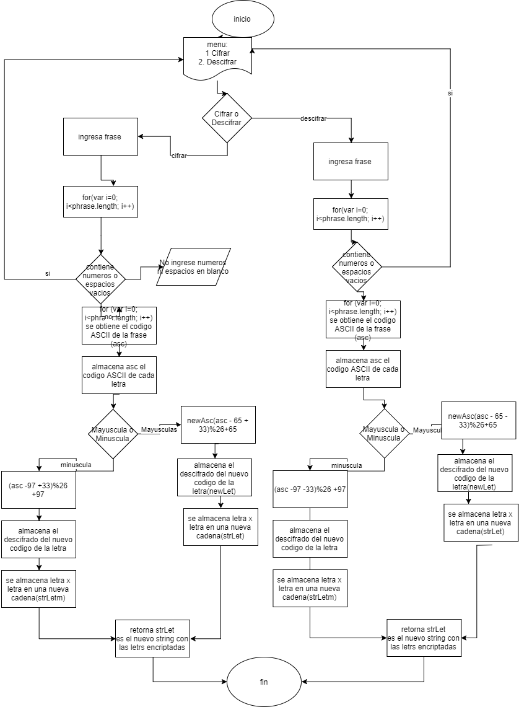

# Cifrado Cesar
___
Crea una web que pida, por medio de un prompt(), una frase al usuario y devuelva el mismo mensaje encriptado según el algoritmo de Cifrado César con el parámetro de desplazamiento de 33 espacios hacia la derecha
~~~
Por ejemplo:

Texto original: `ABCDEFGHIJKLMNOPQRSTUVWXYZ`

Texto codificado: `HIJKLMNOPQRSTUVWXYZABCDEFG`
~~~
+ Creamos una variable `option` que pide por medio de un prompt que elija dos opciones:
    1.Cifrar 2. Decifrar 3. Salir
+ Por medio de un `if` validamos que el número ingresado por el usuario sea 1, 2 y 3, en todo caso sale un `alert` donde pide que se ingrese solamente 1 o 2.
+ Caso contrario, elige entre 1 o 2, el programa pedirá que ingrese una frase.
+ Mediante un `for` recorremos la frase del usuario y evaluamos que la frase no contenga espacios en blanco ni números. 

### Función Cipher

+ Creamos la función `cipher` que contiene como parámetro a la frase del usuario.
+ Creamos un string vacío donde se almacenarán los nuevos valores.
+ Mediante un for recorremos letra a letra la frase ingresada.
+ En una nueva variable obtenemos el código ASCII de cada letra mediante el método `charCodeAt`.
+ Evaluamos los números en código ASCII mediante un `if`. Primero evaluamos las mayúsculas que según el código ASCII se encuentran en el rango de 65 a 90:
~~~
if (asc>=65 && asc<=90)
~~~
+ Luego aplicamos la fórmula para obtener la nueva posición en código ASCII.
~~~
var newAsc = (asc-65 +33)%26 + 65
~~~
+ Desciframos el nuevo código a letras mediante el método `String.fromCharCode`.
+ Almacenamos letra por letra en el nuevo string.
+ En caso contrario, mediante un `else.if` evaluamos las letras minúsculas del mensaje que según el código ASCII comienza en 97 la a minúscula y termina en 122 la z minúscula.

### Función Decipher

+ Creamos la función `decipher` con el parámetro de la frase del usuario `phrase`, que devolverá una frase encriptada a la frase original.
+ Creamos un string vacío donde se almacenarán los nuevos valores.
+ Recorremos la frase ingresada mediante un `for`, y obtenemos el código ASCII de cada letra mediante el método `charCodeAt` en una nueva variable `asc`.
+ Al igual que para cifrar una frase, evaluamos mediante la fórmula para el caso de mayúsculas y minúsculas.
+ Desciframos ese nuevo código a letra mediante `String.fromCharCode` y lo almacenamos letra por letra en el nuevo string.

